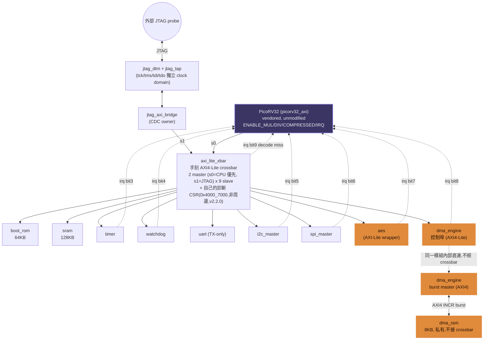

# RISCV_SOC

A from-scratch RISC-V SoC platform: a vendored PicoRV32 core, a hand-written
AXI4-Lite crossbar, an AES-128 accelerator with CBC/CTR chaining and an AXI4
burst DMA engine, a JTAG debug bridge, and a standard peripheral set.
Simulation-based sign-off (Verilator + Yosys/Nangate45 + OpenSTA) — no FPGA
or ASIC tape-out target.

## Architecture



Purple = vendored third-party IP (only `picorv32_axi` — everything else on
this diagram is this project's own RTL). Orange = the two headline
deliverables (AES + DMA). Full rationale for every design choice on this
diagram: [`docs/architecture.md`](docs/architecture.md). A styled standalone
version (matching this palette) lives in
[`images/architecture_versions/`](images/architecture_versions/).

## Features

### CPU Core
- [PicoRV32](https://github.com/YosysHQ/picorv32), RV32IMC, vendored
  unmodified (`ENABLE_MUL/DIV/COMPRESSED/IRQ=1`) — see
  [`rtl/core/VENDORED_SOURCE.md`](rtl/core/VENDORED_SOURCE.md)
- Single AXI4-Lite master via the `picorv32_axi` adapter
- Non-standard interrupt mechanism: custom `getq`/`setq`/`retirq` opcodes,
  not RISC-V CSR interrupts
- Known limitation (by design of the vendored adapter, not this project's
  RTL): `picorv32_axi` never checks `BRESP`/`RRESP` — see **System** below
  for how the crossbar's own diagnostic CSR works around that

### Bus Infrastructure
- Hand-written AXI4-Lite crossbar (`axi_lite_xbar`) — the project's core
  differentiator, not vendored
- 2 masters (`s0`=CPU, fixed-priority; `s1`=JTAG bridge) × 9 slaves; write
  and read channel groups arbitrated independently, grant locked for the
  full duration of an in-flight transaction
- Spec-correct `DECERR` on decode-miss (v2.2.0 — was `SLVERR` before, see
  [`docs/memory_map.md`](docs/memory_map.md) §2.2); `SLVERR` reserved for a
  real, mapped slave rejecting an operation (e.g. a write to a read-only
  register)
- Its own diagnostic CSR window (`0x4000_7000`, not a peripheral slave)
  latching the last decode-miss address per direction, plus `irq` bit 9 —
  added because the CPU adapter above never checks response codes on its own
- Single-outstanding per channel group; no burst support by design — DMA
  gets a completely separate, private AXI4 burst path instead of adding
  burst logic project-wide

### Memory
| Region | Base | Size | Notes |
|---|---|---|---|
| Boot ROM | `0x0000_0000` | 64 KB | `$readmemh`-loaded |
| SRAM | `0x1000_0000` | 128 KB | byte-strobe writes |
| DMA RAM (private) | separate address space | 8 KB | not on the crossbar — only `dma_engine`'s own AXI4 burst master can reach it |

### Peripherals
| Peripheral | Interface | Key Features |
|---|---|---|
| Timer | AXI4-Lite | down-counter, auto-reload, sticky `EXPIRED`, one-cycle `irq` pulse |
| Watchdog | AXI4-Lite | `WARNING` interrupt at a configurable margin, level-held `wdog_reset_req`, `KICK` |
| UART | AXI4-Lite | TX-only (no RX, no FIFO — documented scope cut) |
| I2C | AXI4-Lite | master, byte-level FSM; no clock stretching or multi-byte burst (documented scope cut) |
| SPI | AXI4-Lite | master, all 4 CPOL/CPHA modes, configurable clock divider |

### DMA
- `dma_engine`: AXI4-Lite control port (crossbar slave 8) + a real AXI4
  burst master, entirely separate ports on the same module
- Streams multi-block messages straight through `aes_chain` into the private
  `dma_ram` — zero CPU involvement per block once `CTRL.START` is written
- Verified end-to-end against NIST SP 800-38A vectors (CBC encrypt, CTR, CBC
  decrypt) — 15/15 checks green; measured 39.0 cycles/block average
  (burst read + AES + burst write + FSM overhead), see
  [`docs/verification/performance.md`](docs/verification/performance.md)

### Crypto
- `aes_core`: AES-128 encrypt/decrypt built from FIPS-197 first principles
  (S-box/inverse S-box and GF(2⁸) multiply-by-constant helpers derived, not
  hand-transcribed), ~21 cycles/block iterative datapath
- `aes_chain`: CBC/CTR mode-of-operation wrapper (NIST SP 800-38A) around
  the unmodified `aes_core`
- Verified against FIPS-197 Appendix B/C.1 + NIST SP 800-38A Appendix
  F.2/F.5 official vectors in both directions, plus a 500-iteration
  differential test against an independent from-scratch C++ reference model
- `KEY` registers are deliberately write-only — no key readback, unlike
  every other R/W register in this project
- Explicit non-goals documented in [`docs/specs/aes_notes.md`](docs/specs/aes_notes.md):
  no side-channel hardening, not production-secure

### Debug & Trace
- `jtag_tap`: IEEE 1149.1 16-state TAP FSM, verified against an independent
  C++ transition-table model over 5000 random TMS steps, plus the "5×TMS=1
  always returns to Test-Logic-Reset" safety property
- `jtag_dtm`: IR/DR registers (`IDCODE`, `BYPASS`, `AXI_ADDR`/`AXI_DATA`/`AXI_CTRL`)
- `jtag_axi_bridge`: the only module crossing the `tck`/`clk` clock domains,
  toggle-bit synchronization (not level-based — a level synchronizer was
  tried first and silently missed short pulses, see
  [`docs/project_retrospective.md`](docs/project_retrospective.md))
- Scope: register/memory read-write access to the system bus only — **not**
  a full CPU debug unit (no halt/single-step; PicoRV32 has no hardware hook
  for that, and forking the vendored core would violate this project's
  "vendored stays unmodified" rule). Full rationale:
  [`docs/specs/jtag.md`](docs/specs/jtag.md)

### System
- Single 32-bit `irq` bus into PicoRV32 — bits 3-9 used (Timer/Watchdog/I2C/SPI/AES/DMA/crossbar decode-miss); every source is a one-cycle pulse, not level-sensitive (a real bug found in Phase 2, see the retrospective)
- One clock domain (`clk`); the only CDC boundary is JTAG's `tck`, owned entirely by `jtag_axi_bridge`
- Active-low asynchronous reset (`resetn`) — retrofitted from active-high in v2.0.0

## Project Structure

```
RISCV_SOC/
├── blocks/              # One directory per hardware block, each with its own rtl/lint/dv
│   ├── aes/              #   AES core + key expansion + CBC/CTR chain (+ standalone syn/sta)
│   ├── axi_lite_xbar/    #   Hand-written AXI4-Lite crossbar — this project's core differentiator
│   ├── boot_rom/, sram/  #   Memory behavioral models
│   ├── dma/              #   AXI4 burst DMA engine + private dma_ram
│   ├── i2c/, spi/, timer/, uart/, watchdog/   # Peripherals
│   ├── jtag/             #   TAP + DTM + AXI bridge (JTAG debug path)
│   └── soc_top/          #   Top-level integration (rtl/ = symlinks into the blocks above) + whole-SoC syn/sta
├── rtl/
│   ├── core/             #   Vendored PicoRV32 (unmodified — see VENDORED_SOURCE.md)
│   └── include/          #   Shared AXI4-Lite/AXI4 defines, address map
├── fw/                   # Firmware: crt0, ISR, linker script, the hello-world test program
├── scripts/              # Build / lint / regression / coverage / dashboard automation
├── docs/                 # Architecture, memory map, per-block specs, verification & performance reports
├── reports/sign_off/     # Committed sign-off snapshot — open dashboard.html directly, no toolchain needed
└── images/               # Architecture diagrams (reference PNG + versioned HTML mockups)
```

`dv` = design verification (this project's testbench directories) — matches
common ASIC-industry naming more closely than a bare `sim`.

## Memory Map

| Region | Base | Size |
|---|---|---|
| Boot ROM | `0x0000_0000` | 64 KB |
| RAM | `0x1000_0000` | 128 KB |
| Peripheral region | `0x4000_0000` | 4 KB windows, see below |
| *(unmapped)* | — | → `DECERR` |

| Offset | Address | Peripheral |
|---|---|---|
| `0x0` | `0x4000_0000` | Timer |
| `0x1` | `0x4000_1000` | Watchdog |
| `0x2` | `0x4000_2000` | UART |
| `0x3` | `0x4000_3000` | I2C |
| `0x4` | `0x4000_4000` | SPI |
| `0x5` | `0x4000_5000` | AES |
| `0x6` | `0x4000_6000` | DMA (control port) |
| `0x7` | `0x4000_7000` | crossbar's own diagnostic CSR — **not a peripheral slave** |

Per-register offsets for each peripheral: `docs/specs/*.md`. Full rationale
for the `DECERR`/`SLVERR` split and the diagnostic CSR: `docs/memory_map.md`.

## Statistics

All numbers below are measured (synthesis/STA/coverage runs), not estimated.

| Metric | Value |
|---|---|
| Hand-written RTL (this project, excl. vendored PicoRV32) | 3,230 lines / 17 files |
| Testbench (Verilator C++ + fake-slave/BFM Verilog) | 3,564 lines / 24 files |
| Firmware (C + assembly) | 290 lines |
| Hardware blocks | 12 |
| Independent regression tests | 19/19 passing |
| Line coverage (this project's own RTL) | 96.8% |
| Toggle coverage (deduped per-bit, post-waiver) | 91.4% (9142/9998 bits) |
| FSM state coverage | 100% (11/11 state machines) |
| Lint findings (Verilator, own RTL) | 135, all triaged |
| Gate count (Nangate45, whole SoC incl. CPU) | 86,338 cells / 136,510 µm² |
| Fmax, typical corner | 347.1 MHz |
| Fmax, slow corner (multi-corner STA) | 19.3 MHz |

Full methodology: [`docs/verification/summary.md`](docs/verification/summary.md)
(tests + coverage + CDC + formal LEC) and
[`docs/verification/performance.md`](docs/verification/performance.md) (timing/throughput).

## Tool Support

| Tool | Used for |
|---|---|
| [Verilator](https://www.veripool.org/verilator/) | Lint, regression, line/toggle/branch coverage |
| [Yosys](https://yosyshq.net/yosys/) + Nangate45 | Synthesis (open PDK standard-cell library) |
| [OpenSTA](https://github.com/parallaxsw/OpenSTA) | Single- and multi-corner static timing analysis |
| xPack `riscv-none-elf-gcc` | Firmware toolchain |

Exact tested versions and install steps: [`TOOLCHAIN.md`](TOOLCHAIN.md).

## Quick Start

```bash
./scripts/bootstrap_check.sh   # verifies every tool + PDK env var is in place
./scripts/reproduce_all.sh     # firmware -> lint -> regression -> coverage
                                # -> synth+STA (if PDK present) -> dashboard
```

Fastest way to check everything's still green (tools already set up):

```bash
./scripts/run_regression.sh    # rebuilds + runs all 19 block testbenches
./scripts/run_lint.sh          # independent lint pass, one report per block
```

Full whole-SoC sign-off snapshot (regression + lint + synthesis + STA +
coverage + an HTML dashboard) into `reports/sign_off/`:

```bash
./scripts/collect_soc_reports.sh
```

`reports/sign_off/dashboard.html` opens directly in a browser — no
toolchain required — for a graphical view of coverage bars, the FSM
state-coverage checklist, and all 135 lint findings triaged by category.

## License

MIT — see [`LICENSE`](LICENSE). The vendored `picorv32.v` keeps its own
[ISC license](rtl/core/COPYING) (permissive, MIT-compatible).

## Further Reading

- [`docs/phase_plan.md`](docs/phase_plan.md) — the original phase-by-phase
  plan, with entry/exit criteria for each phase
- [`CHANGELOG.md`](CHANGELOG.md) — what changed in each tagged release, and why
- [`docs/project_retrospective.md`](docs/project_retrospective.md) — every
  real bug found across the project, root cause and fix, phase by phase
- [`docs/verification/summary.md`](docs/verification/summary.md) — the full
  test list plus coverage/CDC/formal-LEC methodology
- [`docs/verification/performance.md`](docs/verification/performance.md) — Fmax, throughput, and
  interrupt-latency measurement methodology
