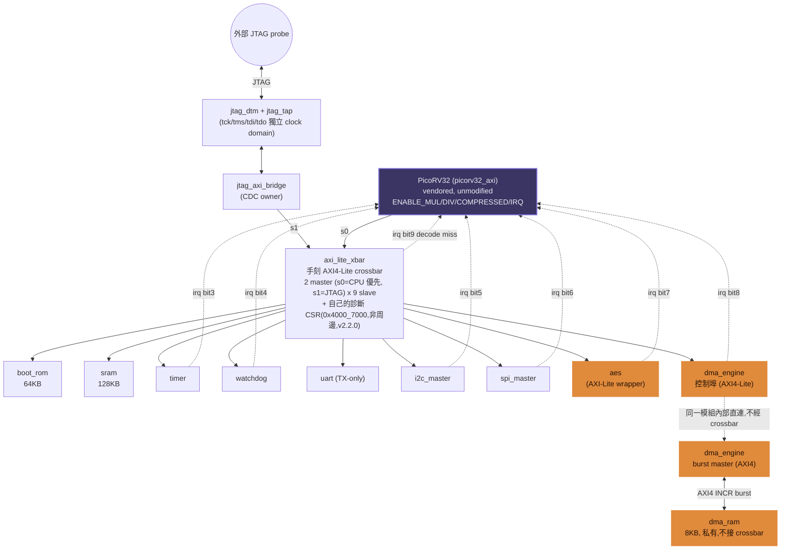

# Architecture

整個 SoC 的模組組成、匯流排拓樸、中斷路由。個別模組的暫存器介面/驗證細節見 `docs/specs/*.md`；位址配置見 `docs/memory_map.md`；效能數據見 `docs/verification/performance.md`。

## 1. 頂層組成

顏色對應跟 `images/architecture.html`(渲染成 `images/architecture.png` 的原始檔)保持一致：`CPU`(唯一 vendored 的節點)用紫藍色、`AES`/`DMA` 這組 Phase 6 headline deliverable 用橘色，其餘手刻周邊維持預設色。

## 2. 匯流排：AXI4-Lite crossbar

`axi_lite_xbar.v` 是這個專案的核心差異化元件——手刻,不是 vendor 來的。

- **2 個 master**：s0 = CPU（`picorv32_axi`),s1 = JTAG debug bridge。仲裁是 fixed priority、CPU 贏,理由：JTAG 是偶爾用一下的除錯路徑,不需要跟即時執行的 CPU 搶公平性。寫入通道跟讀取通道**各自獨立仲裁**（同一拍 s0 可能贏寫、s1 贏讀),grant 在整筆交易期間鎖定,不會中途被搶走——這條規則本身是從一個真實 bug 學到的（見 `docs/specs/jtag.md` 和 `docs/project_retrospective.md`)。
- **9 個 slave**：ROM、RAM、Timer、Watchdog、UART、I2C、SPI、AES、DMA（控制埠)。位址解碼在 `decode_addr()`,未命中的位址由 crossbar 自己回 `DECERR`(v2.2.0 前是 `SLVERR`,見 `docs/memory_map.md` §2.2 的規範說明),不會誤觸真正的 slave。crossbar 自己另外還有一塊不算在這 9 個 slave 裡的診斷 CSR window(`0x4000_7000`,v2.2.0),記錄最近一次 decode miss 的位址並觸發 `irq` bit 9,細節見 `docs/memory_map.md` §2.1。
- **Single-outstanding**：每個 channel group（write / read)同一時間只有一筆交易在飛,不假設任何 master 的行為（AW/W 可能不同拍到),對未來換掉 PicoRV32 的 adapter 也成立。
- **不支援 burst**——這是刻意的範圍縮減。Phase 6 的 DMA 需要真正的 AXI4 burst 效率,但把整個 crossbar 改成 burst-capable,會讓其他 8 個單拍就夠用的 slave 白白多繞一層邏輯。所以 DMA 走**兩條分開的路**：AXI4-Lite 控制埠像其他周邊一樣接 crossbar,AXI4 burst 資料路徑直接點對點接一塊私有的 `dma_ram.v`,完全不上 crossbar（細節見 `docs/specs/dma.md`)。

## 3. CPU：PicoRV32

Vendored,原封不動（見 `rtl/core/VENDORED_SOURCE.md`)。設定：`ENABLE_MUL=1`、`ENABLE_DIV=1`、`COMPRESSED_ISA=1`、`ENABLE_IRQ=1`、`MASKED_IRQ=0`（全部開放)、`LATCHED_IRQ=0xFFFFFFFF`（全部用邊緣觸發鎖存,不是 level-sensitive——這是 Phase 2 踩過的真實教訓,見 retrospective)。

已知限制（Phase 1 就存在,一直沒改)：`picorv32_axi` 這個 adapter 完全沒接 BRESP/RRESP pin,response code 完全不檢查(`OKAY`/`SLVERR`/`DECERR` 都一樣)。踩到未映射位址不會讓匯流排卡死,但 CPU 自己也不會發現——這正是 v2.2.0 加診斷 CSR + `irq` bit 9(見第 4 節)的動機:既然回應通道本身指望不上,就另外開一條路徑讓 firmware 事後查得到。

## 4. 中斷架構

單一個 32-bit `irq` bus 接進 PicoRV32 的 `irq` port,bit 配置：

| Bit | 來源 | 說明 |
|---|---|---|
| 0-2 | PicoRV32 內建 | bus error / illegal instruction / (未用) trap,不是這個專案自己的周邊 |
| 3 | Timer | EXPIRED |
| 4 | Watchdog | WARNING |
| 5 | I2C | 一次 transfer 完成 |
| 6 | SPI | 一次 transfer 完成 |
| 7 | AES | 一個 block 運算完成 |
| 8 | DMA | **整個**多 block 操作完成（不是每個 block)|
| 9 | axi_lite_xbar(v2.2.0) | decode miss(讀或寫任一方向踩到未映射位址),搭配 `0x4000_7000` 的診斷 CSR 一起用,見 `docs/memory_map.md` §2.1 |

每個周邊的 `irq` 輸出都是**單一 cycle 的 pulse**,不是 level-sensitive——這是 Phase 2 一開始犯的錯誤又修正過來的教訓（若是 level-sensitive,PicoRV32 沒有真的邊緣觸發鎖存機制配合的話,同一個中斷可能被重複觸發或漏接),詳見 `docs/project_retrospective.md`。實際測得的中斷延遲(Timer IRQ 訊號拉起到 PicoRV32 真正進到 ISR)是 3-14 cycles,平均 8.6 cycles,見 `docs/verification/performance.md`。

## 5. 除錯路徑：JTAG

`jtag_tap.v` + `jtag_dtm.v` 在 `tck` 這個獨立的 clock domain 運作（模擬真實 JTAG probe 用自己的時脈驅動),`jtag_axi_bridge.v` 是唯一橫跨兩個 clock domain 的模組,自己擁有 CDC。這條路徑只給系統匯流排（RAM/ROM/所有周邊暫存器)的讀寫存取,**不是**完整的 CPU debug unit——PicoRV32 本身沒有 halt/single-step/讀取暫存器檔的硬體 hook,要做到那個程度需要 fork PicoRV32,違反這個專案「vendored core 不動」的規則。細節與範圍取捨見 `docs/specs/jtag.md`。

## 6. 加密:AES + DMA

- `aes_core.v`(Phase 4):從 FIPS-197 第一原理刻的 AES-128 iterative datapath,~21 cycles/block。
- `aes_chain.v`(Phase 6):包住 `aes_core` 不動,加 CBC/CTR mode-of-operation(NIST SP 800-38A)。
- `dma_engine.v` + `dma_ram.v`(Phase 6):真正的 AXI4 burst master,讓多個 128-bit block 連續透過 `aes_chain` 加解密,CPU 只要設定暫存器、寫一次 START,中間完全不用碰資料。

## 7. 已知範圍界線(刻意,不是遺漏)

這些都是有意識的取捨,不是做一半:

- `dma_ram` 不接 crossbar → CPU/JTAG 沒有路徑預先把資料塞進去,只能透過 DMA 自己的 burst master 存取。真實部署會需要多一層 arbiter/adapter,這個 phase 判斷不值得為了選配延伸再加這層複雜度。
- Watchdog 的 `wdog_reset_req` 只是外露觀察,沒有真的接回去重置 SoC。
- `picorv32_axi` 不檢查任何 response code(`OKAY`/`SLVERR`/`DECERR` 都一樣)——v2.2.0 用診斷 CSR + `irq` bit 9 補這個洞,但那是額外開一條路徑,不是讓 CPU 真的開始檢查 response channel。
- JTAG 橋接沒有真正的 CPU halt/single-step。
- UART 只有 TX,沒有 RX,也沒有 FIFO。
- 幾乎每個周邊(Timer/Watchdog/UART/I2C/SPI/AES/DMA/boot_rom)的 AXI-Lite response channel,都是「固定拉一拍 `s_bvalid`/`s_rvalid` 就自動放下」,沒有真的檢查對方的 `s_bready`/`s_rready`。嚴格照 AXI4 規範,VALID 應該撐到 READY 也是高電位才能撤——這裡目前是「跟這個專案自己的 crossbar 搭配剛好沒事」(crossbar 進入等待狀態就已經先把 `bready`/`rready` 拉高),不是規範保證的正確性。這是跑 `scripts/run_lint.sh`(拿掉 `-Wno-UNUSEDSIGNAL` 後)才浮現的,詳見 `docs/project_retrospective.md`。
- `dma_engine.v` 自己的 AXI4 burst master,完全不檢查 `dma_ram` 回應的 `m_bresp`/`m_rresp`——跟已知的 `picorv32_axi` 不檢查 BRESP/RRESP 是同一類限制,只是這次是這個專案自己寫的模組。
