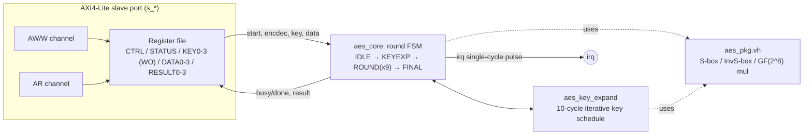

# AES-128 — Specification

`blocks/aes/rtl/aes.v` (AXI-Lite wrapper) + `aes_core.v` (round datapath) + `aes_key_expand.v` (key schedule) + `aes_pkg.vh` (shared S-box/GF(2^8) functions)

## 1. Overview

A from-scratch AES-128 encrypt/decrypt accelerator (FIPS-197), iterative datapath — one round per clock cycle, ~21 cycles per 128-bit block (10 cycles key expansion + 1 initial AddRoundKey + 9 middle rounds + 1 final round). Single in-flight block per operation, same "no queue" convention as every other peripheral in this project.

For the algorithm background (why AES/Rijndael, its FIPS-197 standardization, and why it's considered secure), see `docs/specs/aes_notes.md` — this document only covers the RTL interface.

**Base address**：`0x4000_5000`（`ADDR_PERIPH_AES`，見 `rtl/include/addr_map.vh`）

## 2. Block Diagram

## 3. Interface

| Signal | Dir | Width | 說明 |
|---|---|---|---|
| `clk`, `resetn` | in | 1 | 同步 clock、同步 active-low reset(resetn) |
| `s_aw*` / `s_w*` / `s_b*` / `s_ar*` / `s_r*` | - | - | 標準 AXI4-Lite slave |
| `irq` | out | 1 | 一個 block 運算完成時的**單一 cycle pulse** |

## 4. Register Map

| Offset | Name | R/W | Bits | 說明 |
|---|---|---|---|---|
| `0x00` | CTRL | R/W | `[0]` START `[1]` ENCDEC | 寫 1 到 START 開始一次運算（忙碌中會被忽略）；ENCDEC=0 是 encrypt、1 是 decrypt，START 當下鎖存 |
| `0x04` | STATUS | R/W | `[0]` BUSY (RO) `[1]` DONE (sticky, write-1-to-clear) | |
| `0x10`-`0x1C` | KEY0-3 | **WO** | `[31:0]` | 128-bit 金鑰，KEY0=bytes[0:3]（MSB word）...KEY3=bytes[12:15]。**唯讀一律回 0**——不像專案裡其他暫存器都是真正的 R/W，這是刻意的安全設計：真正的安全 IP 不該讓軟體（或 debug port）把金鑰讀回來 |
| `0x20`-`0x2C` | DATA0-3 | R/W | `[31:0]` | 明文（encrypt）或密文（decrypt）輸入，同樣 MSB-word-first 排列 |
| `0x30`-`0x3C` | RESULT0-3 | RO | `[31:0]` | 運算結果，DONE 設起來後才有效 |

Byte order：DATA0/RESULT0/KEY0 放 128-bit block 最高位的 4 個 bytes（FIPS-197 column-major state 的 byte 0-3），所以 FIPS-197 測試向量的 hex word 可以直接依序複製貼上,不需要 byte-swap。

## 5. Verification

四層驗證，一層比一層廣：

1. **`aes_key_expand` 單元測試**（`blocks/aes/dv/key_expand_sim_main.cpp`）——11 組 round key 逐一比對 FIPS-197 Appendix A.1 的官方金鑰展開範例。
2. **`aes_core` 直接測試**（`core_sim_main.cpp`，跳過 AXI，直接打 core 的訊號）——FIPS-197 Appendix B 與 Appendix C.1 的官方測試向量，encrypt 和 decrypt 兩個方向都驗證。
3. **AXI-Lite 介面測試**（`sim_main.cpp`）——同樣兩組官方向量,但這次透過真正的 AXI4-Lite 暫存器讀寫,額外驗證 KEY 暫存器唯讀、busy/no-queue 行為。
4. **Differential test**（`diff_sim_main.cpp`）——500 組隨機明文/金鑰,同時跑過 RTL（透過 Verilator）和一個獨立、從零寫的 C++ AES-128 軟體參考模型（S-box/Rcon table 用另一套完全獨立的程式碼路徑,在程式啟動時現算,不是抄同一份表),比對兩邊的密文是否一致,並確認 decrypt(encrypt(pt)) == pt。這個軟體模型自己也先過了 FIPS-197 官方向量才會被信任當作 oracle。

合成/timing：`blocks/aes/syn/`、`blocks/aes/sta/` 有針對 `aes_core`（不含 AXI wrapper）在 Nangate45 下的獨立合成 + STA 結果,詳見 `docs/specs/aes_notes.md`。
