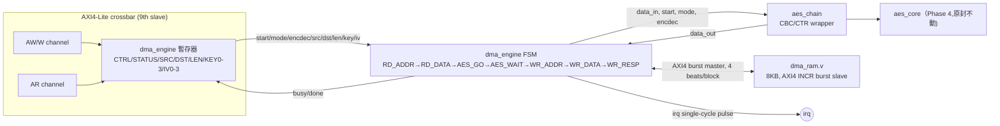

# DMA Engine + AES CBC/CTR — Specification

`blocks/dma/rtl/dma_engine.v`（AXI4-Lite 控制埠 + AXI4 burst master）+ `dma_ram.v`（私有的 AXI4 burst-capable 記憶體）+ `blocks/aes/rtl/aes_chain.v`（CBC/CTR mode-of-operation wrapper，包住 Phase 4 的 `aes_core.v` 不動）

## 1. Overview

Phase 6（選配延伸）：讓 DMA 直接把整段訊息從記憶體搬過 AES、再搬回去，過程中 CPU 完全不用碰任何一個 word——firmware 只要設定好暫存器、寫一次 START，然後 poll（或等 `irq`）整個多 block 的操作做完就好。

這個 phase 有兩個獨立的擴充,合起來才有意義:

1. **`aes_chain.v`**：在不動 Phase 4 `aes_core.v`（單一 128-bit block 的 ECB 原語)的前提下,加一層 CBC/CTR 的 mode-of-operation 邏輯（NIST SP 800-38A)。CBC 依方向在 ECB 前後 XOR 一個會累積的 IV；CTR 則永遠讓 core 走 encrypt 方向處理一個遞增的 counter 產生 keystream,兩個方向都用 XOR。
2. **`dma_engine.v` + `dma_ram.v`**：一個真正發 AXI4 burst（不是單拍的 AXI4-Lite)的 DMA master,每個 128-bit block 做「burst 讀 4 拍 → 灌進 `aes_chain` → burst 寫 4 拍」,寫完自動接下一個 block,全程沒有 CPU 介入。

**Base address（控制埠)**：`0x4000_6000`（`ADDR_PERIPH_DMA`，見 `rtl/include/addr_map.vh`）

### 架構上的關鍵決定：burst 資料路徑跟 crossbar 是分開的

這個專案的 `axi_lite_xbar.v` 是手刻的 AXI4-**Lite** crossbar,天生不支援 burst（沒有 AWLEN/ARLEN,每次交易固定 1 拍)。Phase 6 需要真正的 AXI4 burst 來讓 DMA 的資料搬移有效率,但把整個 crossbar 改成支援 burst,會讓其他 8 個原本單拍就夠用的 slave（Timer、UART、AES 本身...)全部被迫多繞一層 burst 邏輯,得不償失。

所以選擇：DMA engine 對外有**兩個獨立的 master/slave 介面**——

- 一個 AXI4-**Lite** slave 控制埠（CTRL/STATUS/SRC/DST/LEN/KEY/IV 暫存器),接進主 crossbar,跟其他周邊平起平坐,firmware 用一般的 MMIO 讀寫。
- 一個 AXI4（完整版,支援 burst)**master** 埠,直接點對點接到 `dma_ram.v`——一塊只有 DMA 自己能碰、專用的 8KB scratch RAM,完全不經過 crossbar。

代價：`dma_ram.v` 目前在真正的 `soc_top` 裡，CPU（或 JTAG）沒有其他路徑可以預先把明文塞進去、或事後把密文讀出來——這塊記憶體的內容只有 DMA engine 自己看得到、動得了。這個 phase 是選配延伸,決定不為了「讓 CPU 也能存取這塊記憶體」再多蓋一層 arbiter/adapter；`blocks/dma/sim/dma_engine_sim_main.cpp` 用一個測試專用的 AXI4 burst 埠（`dma_engine_testtop.v`,不是可合成的交付物)直接戳 `dma_ram.v` 來預載/驗證資料,`soc_top` 這層的整合測試則只驗證 DMA 控制埠透過真正的 crossbar 可以正確定址（見下方 Verification）。

## 2. Block Diagram

## 3. Interface

| Signal | Dir | Width | 說明 |
|---|---|---|---|
| `clk`, `rst` | in | 1 | 同步 clock、非同步 active-high reset |
| `s_aw*` / `s_w*` / `s_b*` / `s_ar*` / `s_r*` | - | - | AXI4-**Lite** slave（控制埠,接主 crossbar) |
| `m_aw*` / `m_w*` / `m_b*` / `m_ar*` / `m_r*` | - | - | AXI4（完整版)burst master（接 `dma_ram.v`,固定 4-byte beat、INCR burst,見 `rtl/include/axi4.vh`) |
| `irq` | out | 1 | **整個**多 block 操作做完的單一 cycle pulse（不是每個 block 都 pulse 一次)，跟專案裡其他周邊一樣的 LATCHED_IRQ 慣例 |

## 4. Register Map

| Offset | Name | R/W | Bits | 說明 |
|---|---|---|---|---|
| `0x00` | CTRL | R/W | `[0]` START `[1]` ENCDEC `[3:2]` MODE (00=ECB,01=CBC,10=CTR) | 寫 1 到 START 開始整段 LEN-block 操作（忙碌中會被忽略),ENCDEC/MODE 在 START 當下鎖存 |
| `0x04` | STATUS | R/W | `[0]` BUSY (RO) `[1]` DONE (sticky, write-1-to-clear) | |
| `0x08` | SRC_ADDR | R/W | `[31:0]` | `dma_ram` 裡第 0 個 block 的來源位址（byte address） |
| `0x0C` | DST_ADDR | R/W | `[31:0]` | `dma_ram` 裡第 0 個 block 的目的位址 |
| `0x10` | LEN | R/W | `[31:0]` | 要處理的 128-bit block 數（≥1） |
| `0x14`-`0x20` | KEY0-3 | **WO** | `[31:0]` | 128-bit 金鑰，跟 `aes.v` 一樣 MSB-word-first、唯讀一律回 0 |
| `0x24`-`0x30` | IV0-3 | R/W | `[31:0]` | 初始 IV（CBC）/ counter（CTR），START 當下鎖存進 `aes_chain` |

每個 block 固定用一次 4-beat（128-bit）AXI4 burst讀、一次 4-beat burst 寫——不是把整個 LEN-block 訊息包成一個大 burst,這樣 `dma_engine` 內部只需要一個 128-bit 暫存器裝當前 block,不用開一個訊息大小的 FIFO。

## 5. Verification

三層驗證：

1. **`aes_chain` 單元測試**（`blocks/aes/sim/chain_sim_main.cpp`)——直接打 `aes_chain` 的訊號（不經 AXI），驗證 CBC 和 CTR 兩個方向都符合 NIST SP 800-38A Appendix F.2/F.5 官方向量。
2. **`aes.v` 透過 AXI-Lite 的 CBC/CTR 測試**（`blocks/aes/sim/sim_main.cpp` 新增段落)——同樣的向量,這次透過真正的暫存器介面（MODE/LOAD_IV/IV0-3),確認 register map 擴充沒有破壞既有的 ECB 路徑。
3. **`dma_ram` 的 AXI4 burst 單元測試**（`blocks/dma/sim/dma_ram_sim_main.cpp`)——4-beat 讀寫、byte strobe 部分寫入、單拍 burst、連續 burst 之間互不干擾。
4. **`dma_engine` 端到端測試**（`blocks/dma/sim/dma_engine_sim_main.cpp`,透過 `dma_engine_testtop.v` 測試專用 harness)——CBC encrypt 4 blocks、CTR 4 blocks、CBC decrypt 4 blocks（把 test 1 產生的密文解回明文),全部透過真正的 AXI4-Lite 控制埠 + AXI4 burst 資料路徑,比對 NIST SP 800-38A 向量,CPU 全程不碰任何一個 128-bit block。15/15 checks all green。
5. **`soc_top` 整合測試**（`blocks/soc_top/sim/sim_main.cpp`)——JTAG 橋接透過真正的 2-master crossbar 寫入/讀回 DMA 的 `SRC_ADDR` 暫存器,驗證位址解碼把 `0x4000_6000` 正確路由到 crossbar 第 9 個 slave。`dma_ram` 本來就不接在 crossbar 上（見上方架構決定),所以完整的多 block DMA+AES 操作只在 block 層驗證,這裡只驗證控制埠的接線正確。

實作過程中抓到的幾個真實 bug（同一類「用還沒更新的 register 算同一拍的組合邏輯」錯誤,在這個專案裡重複出現超過一次——AES chain 和 SPI CPHA 都踩過同一個坑),詳細的 root-cause 與除錯過程見 `docs/project_retrospective.md`。
