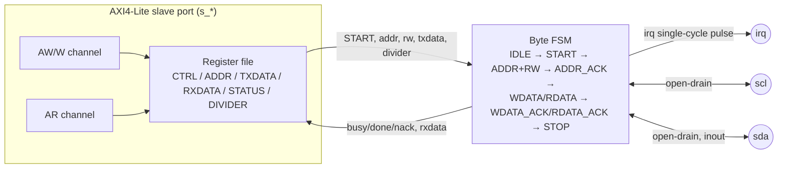

# I2C Master — Specification

`blocks/i2c/rtl/i2c_master.v`

## 1. Overview

Byte 層級的 I2C master：一次交易涵蓋 START、7-bit 位址 + R/W bit、ACK 檢查、一個 data byte、STOP，SCL/SDA 都是 open-drain 建模（只會主動拉低或釋放成高阻抗）。範圍刻意縮小：**不支援 clock stretching**（假設 slave 永遠不會把 SCL 拉低，這是文件化的 scope cut）、也**不支援多 byte burst**（一次交易只送/收一個 byte，跟 `spi_master.v`/`uart.v` 一樣的「no queue」慣例——忙碌中的第二次 START 會被忽略）。

**Base address**：`0x4000_3000`（`ADDR_PERIPH_I2C`，見 `rtl/include/addr_map.vh`）

## 2. Block Diagram

## 3. Interface

| Signal | Dir | Width | 說明 |
|---|---|---|---|
| `clk`, `rst` | in | 1 | 同步 clock、非同步 active-high reset |
| `s_aw*` / `s_w*` / `s_b*` / `s_ar*` / `s_r*` | - | - | 標準 AXI4-Lite slave |
| `scl` | out | 1 | I2C clock，本模組直接驅動（無 clock stretching，故不用 inout） |
| `sda` | inout | 1 | I2C data，open-drain：只會驅動低電位或釋放為 `1'bz`，靠外部 pull-up 讀回高電位 |
| `irq` | out | 1 | 交易完成時的**單一 cycle pulse** |

## 4. Register Map

| Offset | Name | R/W | Bits | 說明 |
|---|---|---|---|---|
| `0x00` | CTRL | R/W | `[0]` START `[1]` RW | 寫 1 到 START 開始一次交易（忙碌中會被忽略）；RW=0 是 write、RW=1 是 read，在 START 當下被鎖存 |
| `0x04` | ADDR | R/W | `[6:0]` | 7-bit slave 位址，START 當下鎖存 |
| `0x08` | TXDATA | R/W | `[7:0]` | 要寫入的 byte（write 交易時使用），START 當下鎖存 |
| `0x0C` | RXDATA | RO | `[7:0]` | 讀到的 byte（read 交易時有效），DONE 設起來後才有效 |
| `0x10` | STATUS | R/W | `[0]` BUSY (RO) `[1]` DONE (sticky, write-1-to-clear) `[2]` NACK (sticky, write-1-to-clear) | NACK：位址沒被任何 slave ACK，或者 write 交易的 data byte 沒被 ACK |
| `0x14` | DIVIDER | R/W | `[31:0]` | SCL 半週期的 core clock cycle 數，跟 `spi_master.v` 同慣例 |

Reset 預設值：`CTRL/ADDR/TXDATA=0`、`STATUS=0`、`DIVIDER=4`。

### 設計上的兩個關鍵教訓（實作時真的踩到的 bug）

1. **STOP 訊號要分兩個 tick 而不是同一拍**：SDA 下降跟 SCL 下降如果在同一個 clock edge 同時發生，任何外部觀察者都無法把它跟「雜訊」區分開來——slave 端的 START condition 偵測邏輯（要求 SCL 在 SDA 下降的前後都維持高電位）永遠不會被觸發。修正方式是把 START 拆成兩步：第一拍只拉低 SDA（此時 SCL 仍為高，這才是真正可觀察的 start condition），下一拍才讓 SCL 落下。
2. **ACK/NACK 的驅動訊號只能在 `scl_falling` 釋放，絕對不能在 `scl_rising` 釋放**：曾經在 slave 端把釋放動作放在 `scl_rising`（也就是 SCL 剛變高、準備被 master 取樣的那一刻），結果 SDA 在 SCL 仍為高電位時上升——這跟 STOP condition 的定義一模一樣，master 端會立刻誤判成一次 STOP，交易被瞬間中止。修正後 ACK/NACK 的值會撐過整個 SCL 高電位期間，只在下一次 SCL 落下時才改變。

## 5. Verification

`blocks/i2c/sim/sim_main.cpp` + `tb/common/fake_i2c_slave.v`（behavioral-only、非 synthesizable 的假 I2C slave，掛在同一組 `scl`/`sda`，帶 `pullup` 模擬真實 bus 的上拉電阻）：

- 驗證重點：
  - Write 交易：正確位址、正確 ACK、slave 收到正確的 byte
  - Read 交易：master 正確讀回 slave 提供的 byte
  - NACK 處理：對一個沒人回應的位址發起交易，STATUS.NACK 正確被設起、交易仍然乾淨地以 STOP 結束（不會卡死 bus）
  - Busy/no-queue：交易進行中改寫 TXDATA、再次寫 START，都必須對「正在進行中」的這次交易完全沒有影響

這是專案裡目前唯一一個雙向、開洩極（open-drain）多方共享同一條線的介面，也是除了 SPI 之外另一個需要自己維護「假從屬裝置」來驗證的周邊。
