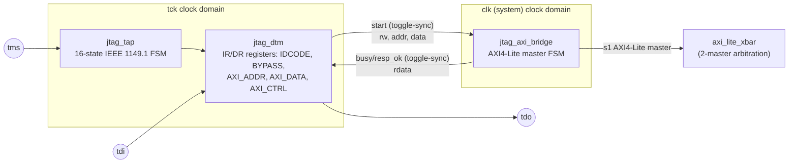

# JTAG Debug Bridge — Specification

`blocks/jtag/rtl/jtag_tap.v` (IEEE 1149.1 TAP FSM) + `jtag_dtm.v` (instruction/data registers) + `jtag_axi_bridge.v` (clock-domain crossing + AXI4-Lite master)

## 1. Overview

Lets an external JTAG probe read and write the SoC's AXI4-Lite address space directly — system-bus access only, **not** a full CPU debug unit. `tck`/`tms`/`tdi`/`tdo` are a genuinely separate clock domain from the system clock (matching real JTAG hardware, where an external probe drives these asynchronously to whatever clock the chip runs internally); `jtag_axi_bridge.v` is the only module that touches both clock domains and owns the CDC (clock-domain crossing).

This bridge becomes the crossbar's **second master** (`s1`, alongside the CPU's `s0`), so `axi_lite_xbar.v` gained real 2-master arbitration this phase — see `docs/specs/axi_lite_xbar` notes / the crossbar's own header comment for the fixed-priority (CPU wins ties) scheme.

### Why no halt/resume, breakpoints, or register inspection

The phase plan scoped this down deliberately: **PicoRV32 has no hardware hooks for halting, single-stepping, or reading its internal register file from outside** — those would require modifying the vendored (unmodified, per this project's rule) CPU core itself. A "real" debug unit (like RISC-V's Debug Module spec, or ARM CoreSight) needs the CPU's cooperation: a halt request line, a way to force-inject instructions or read GPRs while halted, etc. None of that exists in stock PicoRV32. Building it would mean either forking PicoRV32 (against this project's vendoring policy) or building an external instruction-injection shim of significant complexity — out of scope for this project's JTAG phase.

What this bridge *does* give a real debugger: full read/write access to every memory-mapped resource (RAM, ROM, every peripheral register) without CPU cooperation, which covers a surprising amount of practical debugging (inspecting/patching RAM, poking peripheral registers, loading data) even without halt/step.

## 2. Block Diagram

## 3. Interface

| Signal | Dir | Width | Domain | 說明 |
|---|---|---|---|---|
| `tck` | in | 1 | - | JTAG clock, independent of `clk` |
| `resetn` | in | 1 | clk | active-low reset for the clk-domain half (`jtag_axi_bridge`'s own logic) |
| `tck_resetn` | in | 1 | tck | active-low reset for the tck-domain half (`jtag_tap`/`jtag_dtm`, see note below) |
| `tms` | in | 1 | tck | Test Mode Select |
| `tdi` | in | 1 | tck | Test Data In |
| `tdo` | out | 1 | tck | Test Data Out |
| `clk` | in | 1 | - | system clock (bridge only) |
| `m_*` (AXI4-Lite master) | - | - | clk | the bridge's AXI4-Lite master port, wired to the crossbar's `s1_*` |

在這個 block 自己的獨立測試(`jtag_chain_testtop.v`)裡,`resetn`/`tck_resetn` 是兩條各自獨立、由 testbench 直接驅動的訊號,沒有內建的 CDC (clock-domain crossing) 同步邏輯——這是刻意的簡化,因為 block-level 測試只需要模擬 power-on reset,不需要驗證跨時脈域的 reset 同步。真正需要嚴謹處理的 reset domain crossing(異步輸入、雙 flop 同步器)是在 `soc_top.v` 整合層級做的:`resetn_clk_sync`/`resetn_tck_sync` 各自是 clk 域跟 tck 域獨立的同步版本,詳見 `docs/verification/cdc_methodology.md` 的 RDC (Reset Domain Crossing) 章節。

## 4. Register Map (JTAG DR content, selected via IR)

| IR code | Instruction | DR width | 說明 |
|---|---|---|---|
| `4'h1` | IDCODE | 32 | 固定 ID,**LSB 依 IEEE 1149.1 規定固定是 1**(這是外部 JTAG chain scanner 用來自動辨識「這一站有沒有 IDCODE」的標準手法) |
| `4'h2` | AXI_ADDR | 32 | 下一次橋接 AXI 交易要存取的位址 |
| `4'h3` | AXI_DATA | 32 | 要寫入的資料(write);或讀回的結果(read,交易完成後才有效) |
| `4'h4` | AXI_CTRL | 32 | 寫入:`[0]` START(觸發交易)、`[1]` RW(0=write,1=read)。Capture 時改讀:`[0]` BUSY、`[1]` RESP_OK(兩者都是唯讀狀態,從 bridge 同步過來) |
| `4'hF` | BYPASS | 1 | 單純 TDI→TDO passthrough,1 個 tck 延遲。未定義的 IR code 一律當 BYPASS 處理(IEEE 1149.1 建議做法) |

典型一次 AXI write 的操作順序:選 `AXI_ADDR` 掃入位址 → 選 `AXI_DATA` 掃入資料 → 選 `AXI_CTRL` 掃入 `{rw=0,start=1}` → 反覆 Capture-DR 輪詢 `AXI_CTRL` 直到 BUSY=0。Read 則是 `rw=1`,完成後改選 `AXI_DATA` 把結果掃出來。

## 5. Verification

- **TAP FSM**（`blocks/jtag/dv/tap_sim_main.cpp`）：拿一份獨立的 C++ 轉移表模型,對 RTL 跑 5000 步隨機 TMS walk 交叉驗證,外加「從任何狀態連續 5 個 TMS=1 一定回到 Test-Logic-Reset」這個 IEEE 1149.1 安全機制的明確測試。
- **DTM + bridge + CDC**（`jtag_chain_sim_main.cpp`）：TAP+DTM+bridge 串起來接到一個真的 AXI-Lite slave,`tck` 刻意設成比 `clk`慢很多(每個 tck 半週期跑 10 個 clk 週期),驗證 IDCODE、BYPASS、以及透過真正 AXI4-Lite 交易做 write 再 read-back。
- **soc_top 整合測試**：JTAG 透過真正的 soc_top(crossbar 仲裁 + 真正的 sram.v,不是假 slave)寫入一個 RAM scratch word 再讀回,證明整條 JTAG→bridge→crossbar→SRAM 路徑在完整系統裡真的能動,而且不影響既有的 CPU firmware 回歸測試(Hello World + 5 次 Timer 中斷結果不變)。

### 除錯過程抓到的兩個真實 bug(值得記錄)

1. **CDC(clock-domain crossing)漏抓 pulse**:一開始用「同步 BUSY 這個 level 訊號」的方式做 clk→tck 的跨時鐘域,邏輯上看起來合理,但當 `tck` 明顯比 `clk` 慢很多時,AXI-Lite 交易(只要幾個 clk cycle)整個 BUSY-high 的區間可能完全落在兩個 tck edge 之間,tck 側永遠採樣不到!改成雙方各自維護一個 toggle bit、比較兩邊 toggle 是否不同來判斷 BUSY,這個做法不管兩個 clock 週期比例是多少都不會漏接。
2. **crossbar 仲裁的 grant 在交易途中被偷走**:原本 `w_open`(「現在可以重新仲裁」)只檢查 `!w_have_aw && !w_have_w`,但當某個 master 的 AW 和 W 剛好同一拍一起被接受時,crossbar 進入 W_ISSUE 的同一個 transition 也會把這兩個旗標重置回 0——導致 `w_open` 在已經進入 W_ISSUE 的下一拍又暫時讀成「true」,如果這時候另一個 master 剛好也在要求,grant 就會被中途搶走,原本那筆交易的回應最後被送回錯的 master,另一邊則永遠等不到回應。這個 bug 只有在「兩個 master 真的同時競爭、而且剛好卡在那個過渡拍」才會觸發,axi_lite_xbar 自己的單元測試沒抓到,是在 soc_top 整合測試(CPU 持續在背景寫 stack、JTAG 同時嘗試寫入)才浮現的——修法是讓 `w_open` 明確多檢查一個 `w_state==W_IDLE` 條件。
