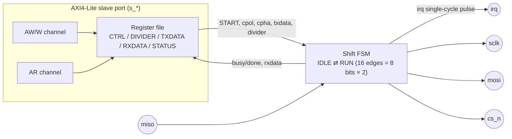

# SPI Master — Specification

`blocks/spi/rtl/spi_master.v`

## 1. Overview

Shift-register 架構的 SPI master，支援全部 4 種 CPOL/CPHA 組合，clock 速率可透過 DIVIDER 調整。跟 I2C master 一樣是「no queue」設計：一次只處理一個 in-flight byte，交易忙碌中收到的第二次 START 會被忽略，軟體必須輪詢 STATUS.busy 或等待 `irq` pulse 才能發起下一次傳輸。

**Base address**：`0x4000_4000`（`ADDR_PERIPH_SPI`，見 `rtl/include/addr_map.vh`）

## 2. Block Diagram

## 3. Interface

| Signal | Dir | Width | 說明 |
|---|---|---|---|
| `clk`, `rst` | in | 1 | 同步 clock、非同步 active-high reset |
| `s_aw*` / `s_w*` / `s_b*` / `s_ar*` / `s_r*` | - | - | 標準 AXI4-Lite slave |
| `sclk` | out | 1 | SPI clock，idle 電位由 CPOL 決定 |
| `mosi` | out | 1 | Master-out-slave-in，genuinely registered（非 combinational `assign`） |
| `miso` | in | 1 | Master-in-slave-out |
| `cs_n` | out | 1 | Chip-select，低有效 |
| `irq` | out | 1 | 傳輸完成時的**單一 cycle pulse** |

## 4. Register Map

| Offset | Name | R/W | Bits | 說明 |
|---|---|---|---|---|
| `0x00` | CTRL | R/W | `[0]` START `[1]` CPOL `[2]` CPHA | 寫 1 到 START 開始一次傳輸（忙碌中會被忽略）；CPOL/CPHA 在 START 當下鎖存 |
| `0x04` | DIVIDER | R/W | `[31:0]` | SCLK 半週期的 core clock cycle 數（≥1，寫 0 會被 guard 成 1，避免 FSM 卡死） |
| `0x08` | TXDATA | R/W | `[7:0]` | 要送出的 byte，START 當下鎖存進 shift register |
| `0x0C` | RXDATA | RO | `[7:0]` | 收到的 byte，DONE 設起來後才有效 |
| `0x10` | STATUS | R/W | `[0]` BUSY (RO) `[1]` DONE (sticky, write-1-to-clear) | 因為 offset `0x10` 需要 5-bit 寬度才裝得下（4-bit 的話 `4'h10` 會直接 truncate 成 0，跟 CTRL 撞位址——這是實作時真的抓到的 bug），本模組所有 offset 的 localparam 都刻意宣告成 5-bit |

Reset 預設值：`CTRL=0`、`DIVIDER=2`、`TXDATA=0`、`STATUS=0`。

### Edge 慣例（CPOL=0 idle 低、CPOL=1 idle 高）

每個 bit period 的「leading edge」是離開 idle 電位的那次變化，「trailing edge」是回到 idle 電位的那次變化：

- **CPHA=0**：leading edge 取樣（capture），trailing edge 換下一個 bit（shift）
- **CPHA=1**：leading edge 換下一個 bit（shift），trailing edge 取樣（capture）——**除了 edge_cnt==0 那一次**：因為 shift register 在 START 當下就已經載入了完整、未經處理的原始 byte，第一個 leading edge 時 bit 7 早就正確地擺在該擺的位置上，此時如果還照常 shift 一次，反而會跳過 bit 7、直接送出 bit 6

這個 `edge_cnt==0` 的例外，是實作 CPHA=1 時真正踩到的 bug（表現為固定收到 `sent << 1`，遺漏 MSB），花了不少功夫用 `$display` 追每個 edge 的實際 mosi/sclk 值才定位到根因，最後才確認是 edge 邏輯本身的問題，而不是一開始懷疑的 zero-delay 模擬 race。

## 5. Verification

`blocks/spi/sim/sim_main.cpp` + `tb/common/fake_spi_slave.v`（behavioral-only 的假 SPI slave，CPOL/CPHA 做成 runtime input 而非 compile-time parameter，一次 build 就能涵蓋全部 4 種模式）：

- 驗證重點：
  - 全部 4 組 CPOL/CPHA 組合，master↔slave 雙向 byte-accurate loopback（master 送出的 byte slave 收到的值、slave 送出的 byte master 收到的值，兩個方向都比對）
  - Busy/done 語意、DONE 的 write-1-to-clear
  - Busy 期間發起第二次 START 會被忽略（no-queue），且不會干擇正在進行中的那次傳輸
