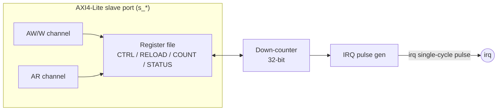

# Timer — Specification

`blocks/timer/rtl/timer.v`

## 1. Overview

一個 32-bit 的 down-counter，自動 reload、AXI4-Lite 介面控制。CPU 設定 RELOAD 值後啟動，counter 每個 clock cycle 減 1，到 0 時自動 reload 回 RELOAD 值，同時觸發一次 IRQ（一次性 pulse）並拉起 sticky 的 STATUS.EXPIRED bit。典型用途：週期性中斷（例如系統 tick、定期 kick watchdog）。

**Base address**：`0x4000_0000`（`ADDR_PERIPH_TIMER`，見 `rtl/include/addr_map.vh`）

## 2. Block Diagram

## 3. Interface

標準 AXI4-Lite slave port（命名慣例見 `rtl/include/axi_lite.vh`）：

| Signal | Dir | Width | 說明 |
|---|---|---|---|
| `clk`, `rst` | in | 1 | 同步 clock、非同步 active-high reset |
| `s_awvalid/awready/awaddr` | - | 1/1/32 | Write address channel |
| `s_wvalid/wready/wdata/wstrb` | - | 1/1/32/4 | Write data channel |
| `s_bvalid/bready/bresp` | - | 1/1/2 | Write response channel |
| `s_arvalid/arready/araddr` | - | 1/1/32 | Read address channel |
| `s_rvalid/rready/rdata/rresp` | - | 1/1/32/2 | Read data channel |
| `irq` | out | 1 | 到期時的**單一 cycle pulse**（非 level） |

`s_awready`/`s_wready`/`s_arready` 永遠是 1（always-ready slave，無 back-pressure）。

## 4. Register Map

Byte offset 相對於 base address：

| Offset | Name | R/W | Bits | 說明 |
|---|---|---|---|---|
| `0x0` | CTRL | R/W | `[0]` EN | 寫入 EN=1 會同時把 COUNT 從 RELOAD 重新載入（每次「enable」都等於 restart） |
| `0x4` | RELOAD | R/W | `[31:0]` | COUNT 到期時（或每次 enable）reload 的目標值 |
| `0x8` | COUNT | RO | `[31:0]` | 目前的 counter 值 |
| `0xC` | STATUS | R/W | `[0]` EXPIRED | Sticky，write-1-to-clear。軟體想確認「有沒有到期過」用這個 bit，跟 `irq` 是分開的兩條路徑 |

Reset 預設值：`CTRL.EN=0`、`RELOAD=COUNT=0xFFFF_FFFF`、`STATUS=0`。

### `irq` 為何是 pulse 而不是 level

PicoRV32 的 `LATCHED_IRQ` 機制每個 clock cycle 都會把 `irq` 輸入 OR 進內部的 pending register，`maskirq` 只決定 pending bit 能不能觸發 ISR **進入**，不會阻止它被重新 latch。如果 `irq` 是 level（維持到軟體清除 STATUS 為止），ISR 執行到一半、還沒把 STATUS 清乾淨時，這個 bit 就已經被重新 latch 一次，unmask 後保證觸發一次多餘的 ISR。改成單一 cycle pulse 就完全避開這個問題——訊號早在 ISR 跑完前就已經自己降下來了。

## 5. Verification

`blocks/timer/sim/sim_main.cpp`，透過共用的 `AxiLiteBfm`（`tb/common/axi_lite_bfm.h`）直接對 `timer.v` 做 cycle-accurate 的 directed test，不經過 CPU：

- 維護一份純 C++ 的 timer 行為模型，每呼叫一次 BFM 就同步 advance 一次，逐 cycle 跟 RTL 的 COUNT/STATUS 讀值比對（並非只驗證最終值）
- 驗證重點：
  - RELOAD/CTRL 基本讀寫
  - EN=1 立即 reload COUNT 的語意
  - 完整跑兩輪 down-count + wraparound，每個 cycle 都比對 COUNT
  - STATUS.EXPIRED 正確在到期時被設定、write-1-to-clear 正確清除，且清除動作不影響仍在跑的倒數
  - EN=0 之後 COUNT 正確停住（含「disable 那一拍仍會依 pre-edge 值再減一次」的 nonblocking-assignment 時序細節）
- 這個測試中確認過一個時序細節並寫進註解：同步讀取（`s_rdata <= count`）永遠反映該 cycle **開始時**的暫存器值，而非同一個 edge 上正在發生的變化——比對前必須在呼叫 `advance_model()` 之前先 snapshot 期望值

也涵蓋在 `blocks/soc_top` 的全 SoC 回歸測試中：firmware 實際設定 Timer 週期性中斷，透過 PicoRV32 的 `getq`/`setq`/`retirq` 機制在真實 ISR 裡處理 5 次中斷，確認端到端行為正確。
