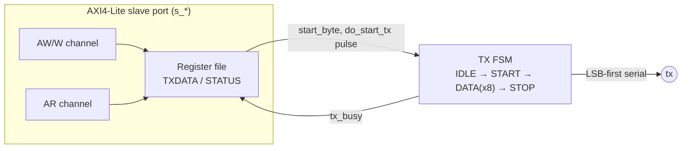

# UART — Specification

`blocks/uart/rtl/uart.v`

## 1. Overview

TX-only 的 UART（Phase 1 範圍；RX 目前未實作）。標準 8N1 格式（8 data bits、無 parity、1 stop bit）、LSB-first、idle 時線路維持高電位。沒有 FIFO：軟體必須在寫下一個 byte 前先確認 STATUS.busy 是 0，否則這次寫入會被直接忽略（documented behavior，不是 bug）。整個專案裡，這是 firmware 唯一的「輸出管道」——Phase 1~3 每個里程碑都是靠這條線把字元印出來驗證系統真的在跑。

**Base address**：`0x4000_2000`（`ADDR_PERIPH_UART`，見 `rtl/include/addr_map.vh`）

## 2. Block Diagram

## 3. Interface

| Signal | Dir | Width | 說明 |
|---|---|---|---|
| `clk`, `rst` | in | 1 | 同步 clock、非同步 active-high reset |
| `s_aw*` / `s_w*` / `s_b*` / `s_ar*` / `s_r*` | - | - | 標準 AXI4-Lite slave |
| `tx` | out | 1 | 序列輸出線，idle 高電位 |

Parameter：`CLKS_PER_BIT`（預設 4，模擬用）——決定一個 bit period 是多少個 clock cycle（`clk_freq / baud_rate`），接真實硬體時要改成對應實際 baud rate 的值。

## 4. Register Map

| Offset | Name | R/W | Bits | 說明 |
|---|---|---|---|---|
| `0x0` | TXDATA | WO | `[7:0]` | 要送出的 byte。若目前 `tx_busy`，這次寫入會被忽略 |
| `0x4` | STATUS | RO | `[0]` busy | 1 = 正在傳送中 |

## 5. Verification

`blocks/uart/sim/sim_main.cpp`，這個測試刻意**不信任 STATUS**，而是直接解碼 `tx` 這條實體序列線（start bit → 8 個 data bit，LSB-first → stop bit），模擬真實的序列埠接收端會看到的行為：

- 驗證重點：
  - 基本收發：寫入 `0x41`('A')，從線路上解碼回來確認是 `0x41`、stop bit 正確為高
  - 第二組不同的資料（`0xA5`）再測一次，排除「解碼器永遠回報同一個值」的假陽性
  - `busy` 訊號的時序（寫入後幾個 cycle 才會反映在 STATUS 上）
  - Write-while-busy 會被丟棄：連續兩次寫入時，只有第一個 byte 真正被傳送，第二次寫入不會排隊、也不會造成額外的一次 frame

這也是整個專案第一個「活的」里程碑（Phase 1 出場條件）的驗證管道：CPU 編譯出的 firmware 透過真實 AXI4-Lite 交易寫這個暫存器，"Hello World" 字串就是這樣從模擬 UART 印出來、被 testbench 逐位元解碼確認的。
