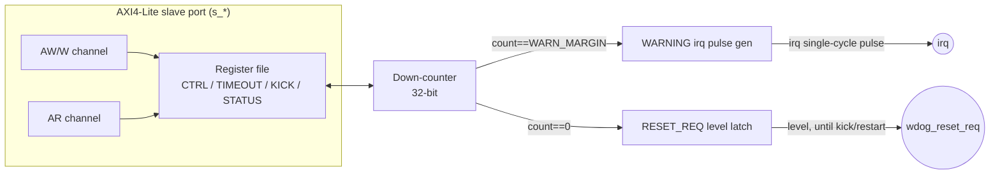

# Watchdog — Specification

`blocks/watchdog/rtl/watchdog.v`

## 1. Overview

一個必須被定期「餵食」（kick）的 down-counter。啟動後持續倒數，倒數到 `WARN_MARGIN`（可設定的 parameter，預設 4）時先發出一次 WARNING 中斷 pulse，提醒軟體「快超時了」；如果軟體仍然沒有 kick，counter 繼續倒數到 0，這時拉起一個**持續到下次 kick/restart 為止**的 `wdog_reset_req` level 訊號，交給上層系統做實際 reset。

**Base address**：`0x4000_1000`（`ADDR_PERIPH_WDT`，見 `rtl/include/addr_map.vh`）

## 2. Block Diagram

## 3. Interface

標準 AXI4-Lite slave port，另外多兩個 top-level 輸出：

| Signal | Dir | Width | 說明 |
|---|---|---|---|
| `clk`, `resetn` | in | 1 | 同步 clock、同步 active-low reset(resetn) |
| `s_aw*` / `s_w*` / `s_b*` / `s_ar*` / `s_r*` | - | - | 標準 AXI4-Lite slave（同 timer.v） |
| `irq` | out | 1 | WARNING 的**單一 cycle pulse** |
| `wdog_reset_req` | out | 1 | Reset 請求，**level** 訊號，持續到下次 KICK 或 restart |

Parameter：`WARN_MARGIN`（預設 4）——倒數剩多少 cycle 時觸發 WARNING。

## 4. Register Map

| Offset | Name | R/W | Bits | 說明 |
|---|---|---|---|---|
| `0x0` | CTRL | R/W | `[0]` EN | 寫入 EN=1 會同時 reload COUNT 到 TIMEOUT（跟 timer.v 一樣「enable=restart」的慣例） |
| `0x4` | TIMEOUT | R/W | `[31:0]` | Reload 目標值 |
| `0x8` | KICK | W | - | 寫入任何值：把 COUNT reload 回 TIMEOUT，同時清掉 STATUS 兩個 bit。讀回固定是 0 |
| `0xC` | STATUS | R/W | `[0]` WARNING (sticky, write-1-to-clear) `[1]` RESET_REQ (RO) | RESET_REQ 是 `wdog_reset_req` 的鏡射，**刻意不能**用 STATUS 寫入清除，只能靠 KICK 或 restart——真正的 reset 請求不該只靠清一個 status bit 就打發掉 |

Reset 預設值：`CTRL.EN=0`、`TIMEOUT=COUNT=0xFFFF_FFFF`、`STATUS=0`。

### 為何 `irq` 是 pulse、`wdog_reset_req` 是 level

跟 timer.v 同樣的 PicoRV32 `LATCHED_IRQ` 考量：WARNING 只需要通知軟體一次，所以是 pulse。但 `wdog_reset_req` 的用途是驅動下游的 reset 產生電路，這種訊號本來就應該維持 asserted 直到問題真正被解決（kick/restart）為止，所以刻意設計成 level。

## 5. Verification

`blocks/watchdog/dv/sim_main.cpp`，同樣是針對裸 RTL 的 cycle-accurate directed test（透過 `AxiLiteBfm`，不經過 CPU）：

- C++ 行為模型逐 cycle 同步推進，包含 WARNING/RESET_REQ 的 pulse/level 語意都各自模擬
- 驗證重點：
  - TIMEOUT/CTRL 基本讀寫
  - 完整倒數過程中，WARNING 精確在 `count == WARN_MARGIN` 那個 cycle 觸發（用 false→true 邊緣偵測，而非只看最終狀態）
  - RESET_REQ 精確在 `count == 0` 那個 cycle 被設起來，且是 level 一路維持
  - `irq` 訊號本身也逐 cycle 跟模型比對，確認它真的只是單一 cycle 寬
  - STATUS 寫 1 只清得掉 WARNING，RESET_REQ 清不掉
  - KICK 能同時清掉兩個 STATUS bit、重新 reload COUNT，且 `wdog_reset_req` 立刻 deassert

這是 Phase 2 的出場條件之一：「Watchdog 逾時後的 reset 時序在逐週期比對的測試中驗證過」，也是這個專案裡第一個要求「精確到哪一個 cycle」而非「最終有沒有發生」的驗證案例。
